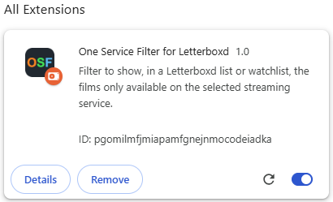

# 'One Service Filter' for Letterboxd

This is a Chrome extension for [Letterboxd](https://letterboxd.com/), to filter a list or watchlist, showing the films only available on the selected streaming service. This is particularly useful, for example, for when you subscribe to a service for just a month or two and want to prioritize the films which are available only on that sevice.

## Installation

This extension is not available on the [Chrome Web Store](https://chromewebstore.google.com/) yet, so the only way to use it by now is by cloning this repository into your local computer and load it on Chrome:

```
git clone https://github.com/HaraldoFilho/OneServiceFilter.git
```

On Chrome type _chrome://extensions/_ on the address bar and on Extensions page, turn on the option **Developer mode** at the top right corner and click on **Load unpacked** at the top left corner.


Select the directory of the extension repository and the extension will appear on the **All extensions** list.



## Usage

_Sign In_ to [Letterboxd](https://letterboxd.com/) and go to a Watchlist or list page of any user. On the **SERVICE** sub-menu, select a streaming service.


Open the menu again and you will se an aditional option: **On selected service only**.


Click on it and the films available on other services will be removed from the list.


### Some important notes
- **The extension doesn't work if you are not signed in.**
- The films are removed only from the current page you are visiting, but if the list has more than one page and the filter is active, every list page you visit will show the films which are only available on the selected service.
- The films counting after you turn on the filter is only for the current page you are visiting, not for the entire list.
